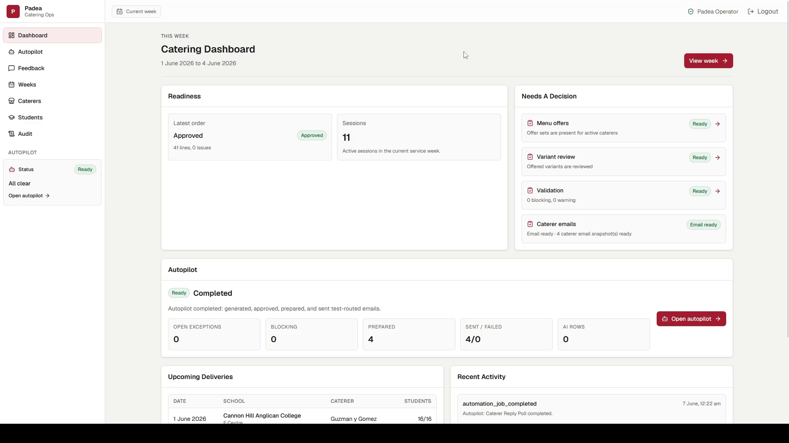
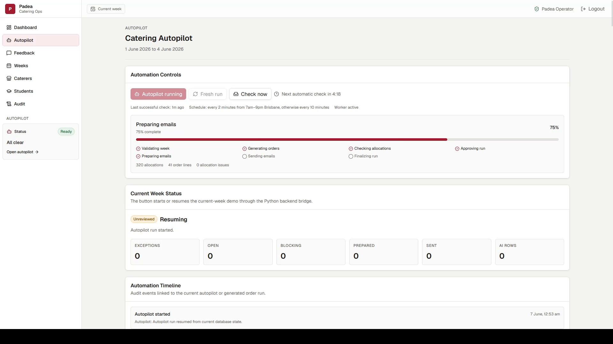
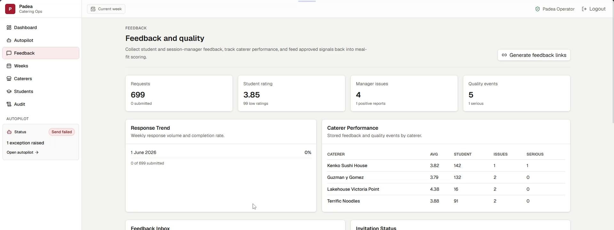

# Padea Catering Autopilot

An operations platform that turns school catering data into weekly meal orders based on attendance, dietary restrictions, and exclusions. It also handles routine follow-up and records each action.

I built this for the **Padea Operations Engineer Competition** with help from Claude. The system uses a Next.js operator console, a Python ordering engine, Supabase/PostgreSQL, and the **Anthropic Claude API**.

## Product tour

### Weekly operations dashboard



The dashboard shows the active service week, delivery schedule, order readiness, automation status, and recent activity.

### Catering Autopilot



The autopilot runs a normal week end to end. Operators can track background jobs, review caterer replies, and handle the cases that need a person.

### Feedback and quality loop



Signed feedback from students and session managers becomes meal preference and caterer quality data for future weeks.

## Highlights

- The competition dataset covers 307 students, 11 tutoring sessions, 5 schools, 4 caterers, and 40 menu dishes supplied through spreadsheets and PDFs.
- Python checks dietary restrictions, absences, exclusions, attendance, and quantities before preference scoring starts. A normal week can then move from offer selection to generated orders and prepared emails without operator input.
- Claude parses free-text caterer replies and feedback into a fixed schema. Python still decides dietary safety, replacements, quantities, approval, and sending.
- Clear confirmations resolve automatically. An unavailable item can trigger a checked replacement order; unclear or unsafe replies go to an operator.
- Feedback, meal history, novelty, and caterer quality influence later selections only after the safety checks pass.
- Idempotency controls stop retries from duplicating work, while actions, interpretations, decisions, email snapshots, and order revisions retain their source, reason, and timestamp.

## How it works

```text
Source spreadsheets and PDFs
           │
           ▼
  Python ingestion pipeline
           │
           ▼
 Supabase / PostgreSQL  ◄──── Next.js operator console
           │
           ▼
Deterministic validation and ordering
           │
           ▼
 Autopilot, communications, and feedback
           │
           ├── Safe and clear ──► continue automatically
           └── Risk or ambiguity ► operator exception
```

The same database state produces the same order facts. Claude handles ambiguous language but does not replace the deterministic safety checks.

## Architecture

| Layer              | Technology                                                | Responsibility                                                                      |
| ------------------ | --------------------------------------------------------- | ----------------------------------------------------------------------------------- |
| Operator interface | Next.js 16, TypeScript, React Server Components, Tailwind | Weekly status, menus, orders, approvals, exceptions, feedback, and audit history    |
| Business logic     | Python 3.12, FastAPI, Pydantic                            | Ingestion, validation, allocation, meal-fit scoring, communications, and automation |
| Data and auth      | Supabase, PostgreSQL, Row Level Security                  | Operational source of truth, operator access, read models, RPCs, and audit records  |
| AI integration     | Anthropic Claude API                                      | Schema-constrained reply and feedback interpretation with recorded provenance       |
| Background work    | Durable Python worker                                     | Autopilot runs, reply polling, feedback delivery, leases, retries, and job events   |

The code is split along these boundaries:

- `src/padea_catering/` owns safety-critical and operational logic.
- `web/` is the Next.js operator experience; it does not reimplement catering rules.
- `supabase/migrations/` defines the database, RLS policies, read views, and audited write contracts.
- `data/raw/` contains immutable competition source files.
- `docs/` records design decisions, edge cases, data provenance, and implementation stages.

## Claude integration

The backend calls Claude through the Anthropic SDK. Responses must match a JSON schema, pass local Pydantic validation, and finish with an accepted stop reason. Each call records its provenance.

Claude is used for:

- interpreting free-text caterer replies;
- extracting preference and quality signals from written feedback;
- helping an operator turn an exception instruction into a proposed action.

Python decides dietary safety, absences, exclusions, quantities, recipients, approvals, and whether an email is sent.

## Run locally

You can inspect the code and run the test suite without external services. The complete operator workflow requires a configured Supabase project and local environment files.

### Requirements

- Python 3.12+
- [uv](https://docs.astral.sh/uv/)
- Node.js 20+
- pnpm
- Supabase project with the repository migrations applied

### Backend

Create an untracked root `.env` with the required backend values:

```bash
SUPABASE_URL=
SUPABASE_SERVICE_ROLE_KEY=
PADEA_BACKEND_SHARED_SECRET=
PADEA_FEEDBACK_LINK_SECRET=
PADEA_WEB_PUBLIC_URL=http://localhost:3000
ANTHROPIC_API_KEY=
PADEA_CLAUDE_MODEL=
```

Then run:

```bash
uv sync
uv run python -m padea_catering.ingestion
uv run python -m padea_catering.validation
uv run uvicorn padea_catering.backend:app --reload
```

### Operator console

Copy `web/.env.example` to `web/.env.local`, add the browser-safe Supabase values and backend bridge configuration, then run:

```bash
pnpm --dir web install
pnpm --dir web dev
```

Open `http://localhost:3000`. Operator routes require a Supabase Auth account linked to `public.operators`.

> [!NOTE]
> Outbound email is intentionally restricted to a configured test-recipient override. Real-recipient rollout is outside the competition build.

## Verification

```bash
uv run ruff check .
uv run pytest
pnpm --dir web lint
pnpm --dir web typecheck
pnpm --dir web build
```

The test suite covers ingestion normalisation, deterministic ordering, meal-fit selection, autopilot idempotency, Claude response validation, reply threading and revisions, feedback processing, exception resolution, and backend bridges.

## Further reading

- [`docs/current_stage.md`](docs/current_stage.md) — current implementation status and known follow-ups
- [`docs/EDGE_CASES.md`](docs/EDGE_CASES.md) — source-data issues and how they are handled
- [`docs/DECISIONS.md`](docs/DECISIONS.md) — architecture and domain decisions

## Competition and authorship

I designed and implemented this project for the **Padea Operations Engineer Competition** with help from Claude. The application uses the Anthropic Claude API for the language tasks described above.
